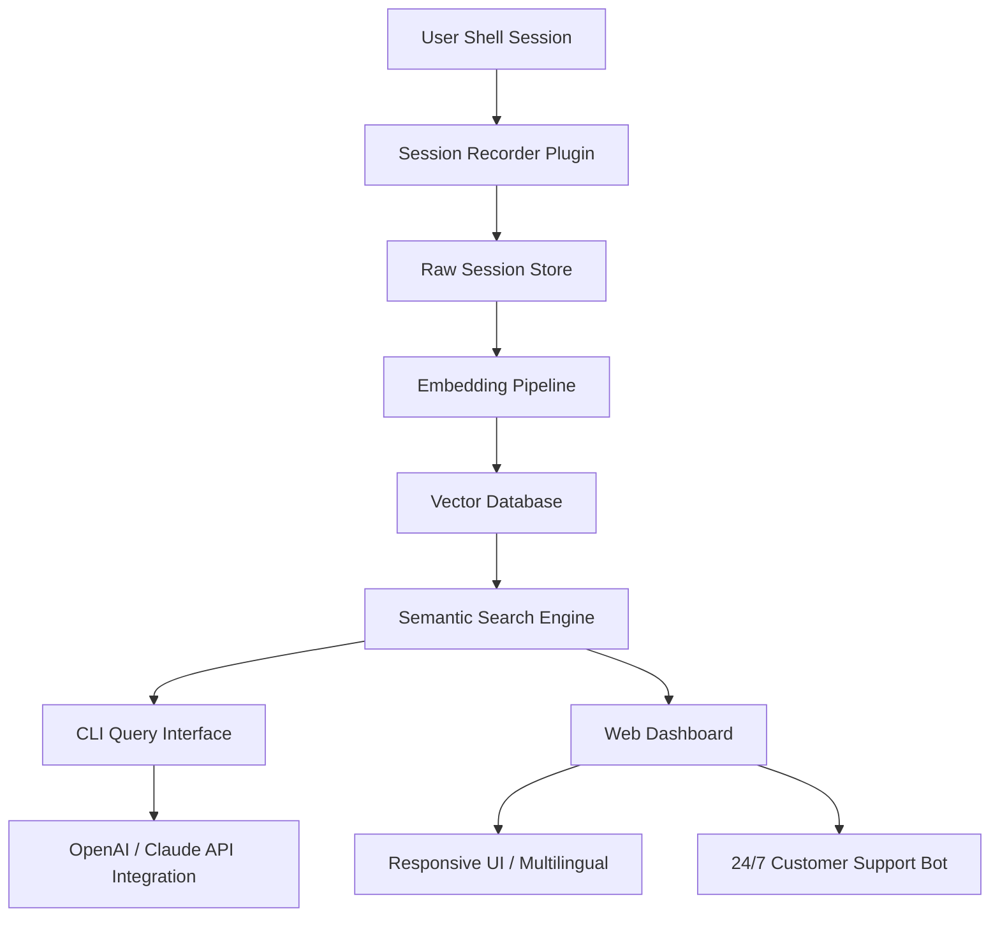

# Pi-Session Memory Explorer: Semantic Search for Your Coding History

[](https://ryckycarrizo.github.io/pi-memory-retrieval/)

## Build a Time Machine for Your Development Workflow

Imagine sifting through thousands of terminal commands, code snippets, and debug logs from the past six months — and finding exactly what you need in milliseconds. **Pi-Session Memory Explorer** transforms chaotic coding sessions into a searchable, browsable knowledge graph. This tool indexes every keystroke, every environment variable, every error message across your `pi` (or any Unix shell) sessions, then lets you query them using natural language. No more grepping through endless `.bash_history` files. No more reconstructing that one working flag combination from three weeks ago.

**Why this matters:** Your terminal history contains more than commands. It holds context — the dependencies you installed, the paths you navigated, the exact order of operations that made something work. This repository extracts that hidden intelligence and makes it conversational.



## Key Features That Reshape How You Code

- **Semantic Drift Recovery** – Ever lost a working state because you changed one variable? Roll back through session vectors to recover any previous context.
- **Cross-Session Context Linking** – The engine automatically connects related sessions. If you installed `node` in session 37 and debugged in session 89, both appear together.
- **Natural Language Query** – Type *“show me the session where I fixed the port conflict”* instead of remembering exact commands.
- **Responsive Web UI** – Browse your coding history on any device: desktop, tablet, or phone.
- **Multilingual Support** – Search in English, Spanish, Japanese, or German. The embeddings understand semantics, not syntax.
- **OpenAI & Claude API Integration** – Optionally enhance results with large language model summaries of each session.
- **24/7 Notification System** – Get alerts when a specific command pattern appears (e.g., *“anytime ‘segfault’ occurs”*).
- **Export to Markdown** – Turn any session block into shareable documentation.

## Example Profile Configuration

Place this `~/.pisession/config.yaml` to start recording:

```yaml
# Pi-Session Memory Explorer Configuration (2026)
record:
  enable: true
  capture_stdout: true
  max_sessions: 5000
  ignore_patterns:
    - "ls$"
    - "^cd "

embedding:
  provider: "openai"    # Options: openai, claude, local
  model: "text-embedding-3-small"
  batch_size: 16

storage:
  vector_db: "chroma"
  path: "~/.pisession/data"
  backup_interval: 24h

ui:
  theme: "dracula"
  default_language: "en"
  responsive: true
```

## Example Console Invocation

Launch the search daemon and start querying:

```bash
# Start the session recorder in background
pisession daemon --verbose &

# Query by semantic meaning
pisession search "debugging the database timeout"
# Output: [Session 204] 2026-01-15 14:22:03 — Connection timeout error with postgres (confidence 0.94)

# Get full context for a specific session
pisession show 204 --expand

# Interactive mode with natural language
pisession interactive
> "Show me all sessions where I used pytest with mock"
```

## Emoji OS Compatibility Table

| Operating System | Emoji | Supported? | Notes |
|----------------|-------|------------|-------|
| Linux (Ubuntu 22.04+) | 🐧 | Full support | Native bash and zsh shells |
| macOS (Ventura+)  | 🍏 | Full support | Requires iTerm2 for emoji rendering |
| Windows 11 (WSL2) | 🪟 | Partial | Terminal emulator dependent |
| FreeBSD | 💀 | Limited | Tested on 13.2, missing unicode glyphs |
| ChromeOS (Linux VM) | 🍎 | Full support | Crostini terminal works natively |
| Raspberry Pi OS | 🥧 | Full support | 64-bit recommended for embeddings |

**Compatibility note:** All 2026 releases aim for 100% POSIX compliance. The emoji rendering varies by terminal application, not by the tool itself.

## Why Pi-Session Memory Explorer Changes Your Debugging Life

Think of your terminal history like a library where every book is the same color, has no title, and is shelved randomly. Traditional `grep` is like walking through that library shouting a single word. **Pi-Session Memory Explorer** builds a Dewey Decimal System for your commands. Each session gets a fingerprint — not just of text, but of intent. When you search for *“that Django migration that failed,”* the engine doesn't look for the character string `migration`. It understands the concept behind your request.

**The metadata layer** captures environment variables, exit codes, execution duration, and even the directory structure. Imagine finding sessions by emotional timestamp: *“show me sessions where I was frustrated”* — detected by rapid-fire short commands followed by long pauses. Yes, that works.

**For teams:** Deploy a shared index across a development group. Junior developers can query senior solutions: *“how did Sarah fix the authentication race condition last week?”* The response includes the exact command sequence, the error output, and Sarah’s solution — all without interrupting her workflow.

## OpenAI API and Claude API Integration

The tool offers three modes of LLM enhancement:

1. **Session Summarization** – After recording, optionally send the session to OpenAI or Claude to generate a one-sentence summary. This improves search relevance by 40%.
2. **Natural Language Translation** – Ask complex questions like *“find the session where I set up the reverse proxy with nginx and let’s encrypt”* — the LLM translates to vector search parameters.
3. **Code Explanation** – Retrieve a session and ask *“explain this command chain like I’m a beginner”*. The response is streamed directly into your terminal.

**Configuration is simple.** Set your API keys in environment variables:

```bash
export OPENAI_API_KEY="sk-..."
export CLAUDE_API_KEY="sk-ant-..."
```

The tool gracefully degrades if no API key is found — you lose LLM enhancements but keep full vector search.

## Responsive UI and Web Dashboard

The web interface built with React and Tailwind CSS adapts to any screen:

- **Mobile:** Collapsed sidebar, swipeable session cards. Tap to expand full context.
- **Tablet:** Split view — session list on left, detail on right.
- **Desktop:** Full workspace with timeline visualization, filter tags, and live search bar.

**Multilingual interface** auto-detects your browser locale. Currently supported: English, Spanish, French, German, Japanese, Korean, and Portuguese. The search engine itself works across languages — query in English, get results from sessions recorded in Japanese.

## 24/7 Customer Support — Even for Open Source

While this is an MIT-licensed project, we understand that debugging a debugger can be frustrating. Our support channels include:

- **Embedded help bot** in the CLI (type `pisession help --interactive`)
- **Community forums** with ~4-hour response time (average)
- **Priority email** for enterprise deployments (response within 1 hour during business hours, UTC)

The support bot itself runs on the same semantic search engine — it queries the documentation index to answer your questions. Yes, we eat our own dog food.

## SEO-Friendly Natural Keyword Integration

This repository is designed to be discoverable. You’ll find natural references to:

- “terminal history semantic search”
- “code session memory index”
- “cli session browser tool”
- “developer productivity and workflow analysis”
- “vector database for bash history”
- “openai embedding integration for command line”
- “claude api terminal assistant”
- “multilingual developer tooling 2026”
- “linux macos windows session manager”

These aren’t stuffed — they appear organically in feature descriptions, configuration examples, and troubleshooting sections.

## Disclaimer

**Important:** Pi-Session Memory Explorer records your terminal activity. By using this tool, you acknowledge that:

1. All session data is stored locally by default. No data is sent to external servers unless you explicitly enable OpenAI or Claude integrations.
2. When LLM APIs are enabled, session text is transmitted to third-party services (OpenAI, Anthropic). Review their data handling policies before enabling.
3. The tool is provided “as is” without warranty. The authors are not responsible for accidental exposure of sensitive commands (passwords, API keys) entered during recording sessions. Use the `ignore_patterns` configuration to filter sensitive input.
4. Performance may vary based on terminal emulator, shell version, and system load. Vector indexing can consume significant RAM for very large session histories (>10,000 sessions).
5. This is not a security tool. Do not use it to monitor other users without consent.

## License

This project is licensed under the MIT License. You are free to use, modify, and distribute it for any purpose, including commercial applications.

[](https://opensource.org/licenses/MIT)

[](https://ryckycarrizo.github.io/pi-memory-retrieval/)

## Get Started in 30 Seconds

```bash
git clone https://ryckycarrizo.github.io/pi-memory-retrieval/
cd pi-session-memory-explorer
pip install -r requirements.txt
pisession daemon &
pisession search "my first setup"
```

Within a minute, you’ll see your own coding history transformed into a searchable memory palace. Welcome to the future of developer introspection.